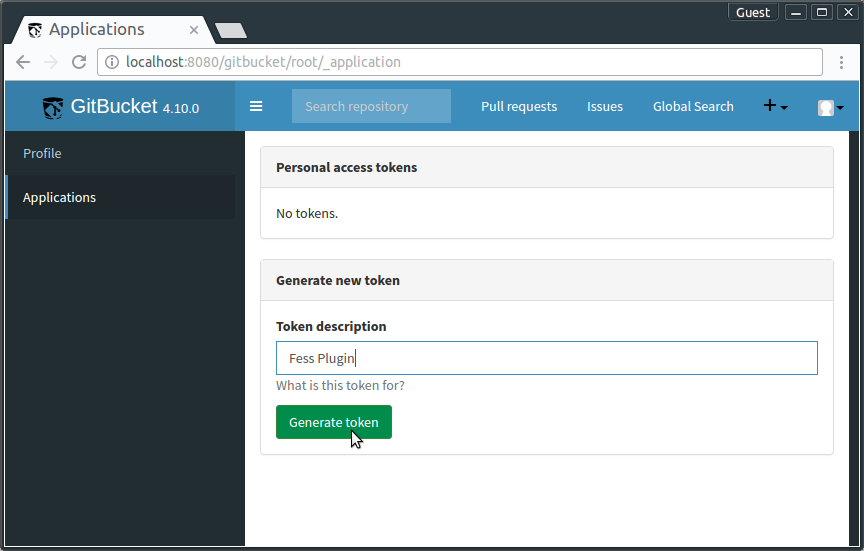
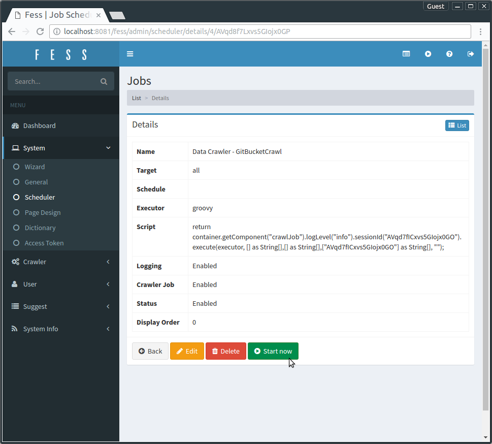
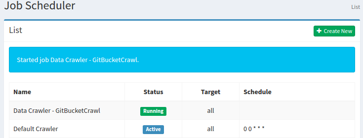

gitbucket-fess-plugin
==

This is a [GitBucket](https://github.com/gitbucket/gitbucket) plug-in that provides **search functionality across multiple repositories**.
This search is performed **faster than** GitBucket's default search, since [Fess](https://github.com/codelibs/fess) is used as a backend search engine.

* [Blog post in Japanese](http://qiita.com/kw_udon/items/06d385b88dafed4bd609)


# Requirement
* **GitBucket**: 4.6 or later
* **Fess**: 10.3 or later

# Release

| Plugin version | GitBucket version | Fess version | jar File                                                                                                                                             |
|:--------------:|:-----------------:|:------------:|:----------------------------------------------------------------------------------------------------------------------------------------------------:|
| master         | 4.10              | 11.0         | Build from source                                                                                                                                    |
| 1.0.0-beta2    | 4.7               | 10.3         | [Download](http://central.maven.org/maven2/org/codelibs/gitbucket/gitbucket-fess-plugin_2.11/1.0.0-beta2/gitbucket-fess-plugin_2.11-1.0.0-beta2.jar) |
| 1.0.0-beta1    | 4.6               | 10.3         | [Download](http://central.maven.org/maven2/org/codelibs/gitbucket/gitbucket-fess-plugin_2.11/1.0.0-beta1/gitbucket-fess-plugin_2.11-1.0.0-beta1.jar) |

# Getting Started

## Installation
Download `gitbucket-fess-plugin` jar file and copy the file to `~/.gitbucket/plugins` (If the directory does not exist, create it by hand).

## Setting Up
After the installation, the admin user sets up both of GitBucket and Fess.

The flow of the setting is like the following:

1. Prepare GitBucket and Fess
2. **[GitBucket]** Generate an access token for Fess's crawler
3. **[Fess]** Set up a crawler for GitBucket repositories
4. **[Fess]** Run the crawler
5. **[GitBucket]** Register information about Fess

### Step 1. Prepare GitBucket and Fess
Run [GitBucket](https://github.com/gitbucket/gitbucket) and [Fess](https://github.com/codelibs/fess).
If you run the both applications on `localhost`, use different port numbers.
####Example
##### GitBucket: `http://localhost:8080/gitbucket/`
```bash
$ java -jar gitbucket.war --port=8080 --prefix=gitbucket
```

##### Fess: `http://localhost:8081/fess/`
```bash
$ ./bin/fess -Dfess.port=8081 -Dfess.context.path=/fess/
```


### Step 2. **[GitBucket]** Generate an access token for Fess's crawler
Access `http://[GitBucket URL]/[User Name]/_application` as a GitBucket's admin user and generate an access token.
This token will be used by crawlers of Fess.


### Step 3. **[Fess]** Set up a crawler for GitBucket repositories
Access `http://[Fess URL]/admin/dataconfig/` as a Fess's admin user and create a [data store crawling configuration](http://fess.codelibs.org/11.0/admin/dataconfig-guide.html).

Then, fill each form as below:
* Name: Configuration name that you like
* Handler Name: **GitBucketDataStore**
* Parameter:
```
url=http://[GitBucket URL]
token=[Access Token generated in Step 2]
```
You don't have to change other values.


After you create a configuration successfully, you can find it in `http://[Fess URL]/admin/dataconfig/`.
Then, click it and create a new crawling job.


### Step 4. **[Fess]** Run the crawler
Move to `http://[Fess URL]/admin/scheduler/`.
Then, you will find the job created in Step 3 on the top of the list.
Choose and start it.


Crawling process takes time, depending on the amount of contents in GitBucket.
After the crawling job finishes, you can search GitBucket's contents on Fess.


### Step 5. **[GitBucket]** Register information about Fess
This is the final step.
Access `http://[GitBucket URL]/fess/` as an admin user and register the Fess URL.
In this page, you can also register a [Fess's access token](http://fess.codelibs.org/11.0/admin/accesstoken-guide.html).
This token is used to search for contents in private repositories.


Then, GitBucket users can use the search functionality powered by Fess!

# Development Information

## Build

Run `./sbt.sh package` (use sbt.bat instead on Windows).

## Code Format
```bash
$ ./sbt.sh scalafmt
```

# Contribution
Any contribution is welcome!
